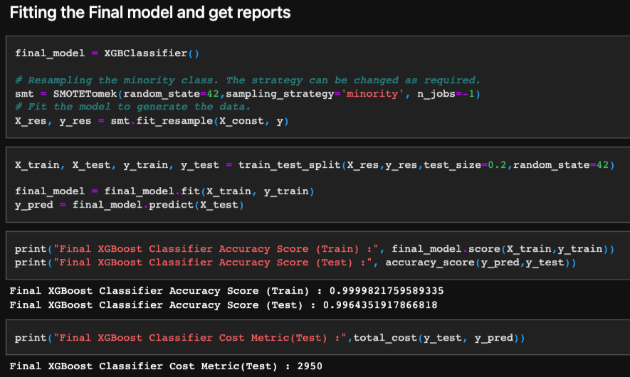

==========================
Machine Learning Approach
==========================
The system in focus is the Air Pressure system (APS) which generates pressurized air that are 
utilized in various functions in a truck, such as braking and gear changes. 
The datasets positive class corresponds to component failures for a specific component of the APS system. 
The negative class corresponds to trucks with failures for components not related to the 
APS system.

Machine Learning (ML) models can be developed and deployed to make predictions so as to minimize 
costs due to either unnecessary checkups or breakdowns caused by APS failures that have been missed.

Given that there is a truck failure, the aim is to determine whether or not the truck failure is related to APS. 
This is a binary classification problem, in which the positive class denotes that a specific APS component was responsible 
for the failure while the negative class denotes that a different factor was responsible.

--------------------
Cost Calculation
--------------------
The problem is to reduce the cost due to unnecessary repairs. So it is required to minimize the false predictions.

.. list-table:: **Cost**
   :widths: 25 25 50
   :header-rows: 1

   * - True Class
     - Positive
     - Negative
   * - **Predicted Class**
     -
     - 
   * - Positive
     - 
     - cost_1 = 10
   * - Negative
     - cost_2 = 500
     -    

* The prediction model's overall cost is equal to the sum of cost_1 times the number of instances with type 1 failure and cost_2 times the number of instances with type 2 failure. 
* In this instance, Cost 1 relates to the expense of a mechanic performing an unnecessary inspection in a workshop
* Cost 2 refers to the expense of failing to notice a malfunctioning truck that could result in a breakdown.
* Total_cost = Cost_1 * No_Instances + Cost_2 * No_Instances.
* From the above problem statement we could observe that, we have to reduce false positives and false negatives. 
* More importantly we have to reduce false negatives, since cost incurred due to false negative is 50 times higher than the false positives.

--------------------
EDA Findings
--------------------

* The target classes are highly imbalanced
* There are missing values in the dataset
* The following table gives a summary of all the combinations of imputation methods and models while experiments were carried out:

.. list-table:: 
   :widths: 25 25 50
   :header-rows: 1

   * - Model
     - Method of Imputation
     - Total Cost
   * - XGBClassifier
     - Simple Imputer-Constant
     - 2950
   * - XGBClassifier
     - Mice
     - 3510
   * - XGBClassifier
     - Knn-Imputer
     - 4460
   * - XGBClassifier
     - Simple Imputer-Mean
     - 4950
   * - CatBoostClassifier
     - Median
     - 5760
   * - Random Forest
     - PCA
     - 34150

* We can observe that XGBClassifier with Simple imputer with strategy constant has performed the best with cost of 2950

