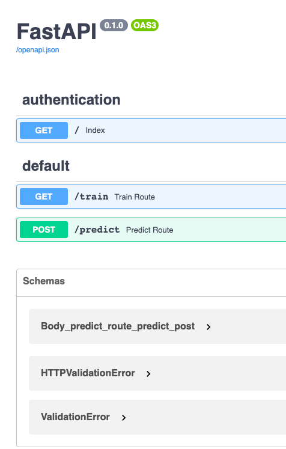
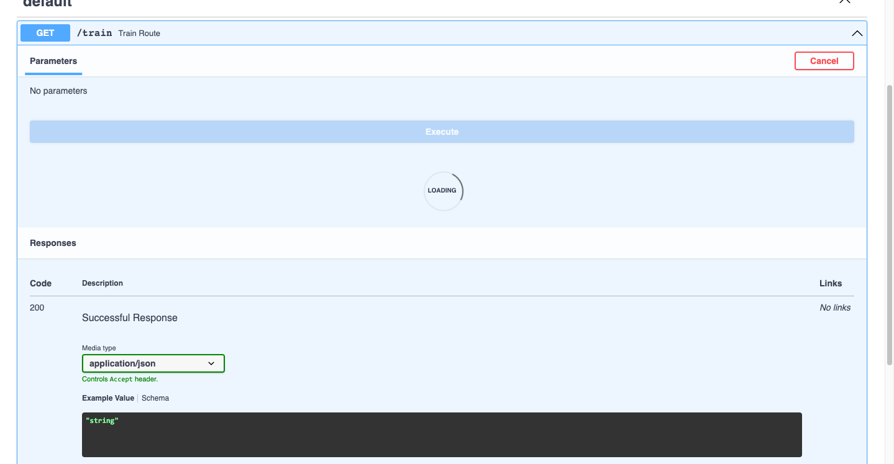
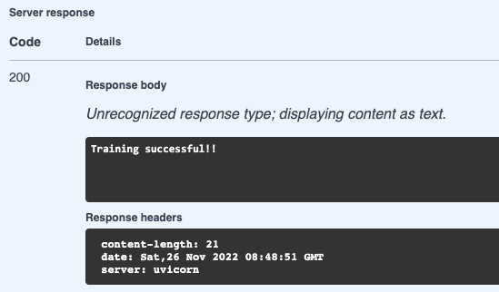
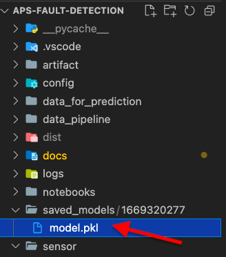
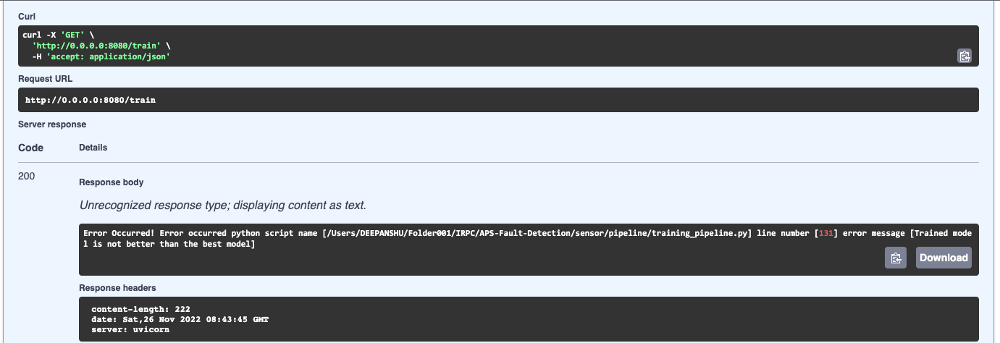
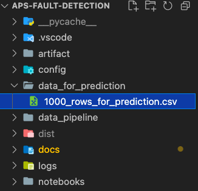
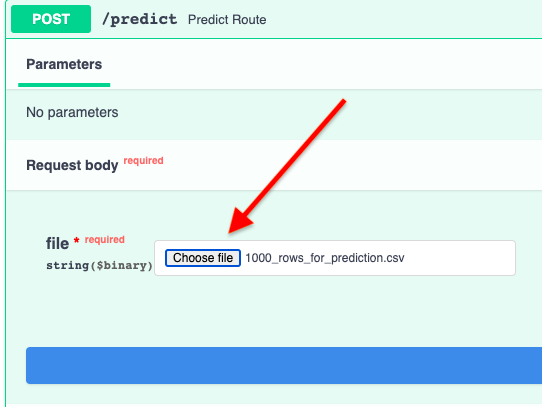
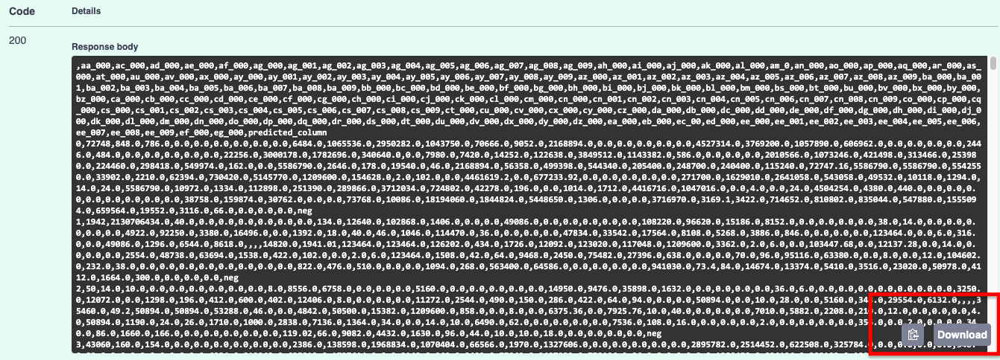

==========================
**Practical Demo**
==========================

This section contains the practical demo of the project.
The model is served as an API using FastAPI as shown below:

---------------------------
**Training Route**
---------------------------

The trained model is saved at a predefined directory:

If a newly trained model is not better than the saved best trained model:

---------------------------
**Prediction Route**
---------------------------

For demo purpose, I have saved data(having 1000 rows) for prediction in the source code repository which can be found at `data_for_prediction/1000_rows_for_prediction.csv`.

Here, we have an option to upload a data file for prediction which will return us the data file along with the predicted classes column

After the predictions are made, we can download the data file along with the prediction column

 