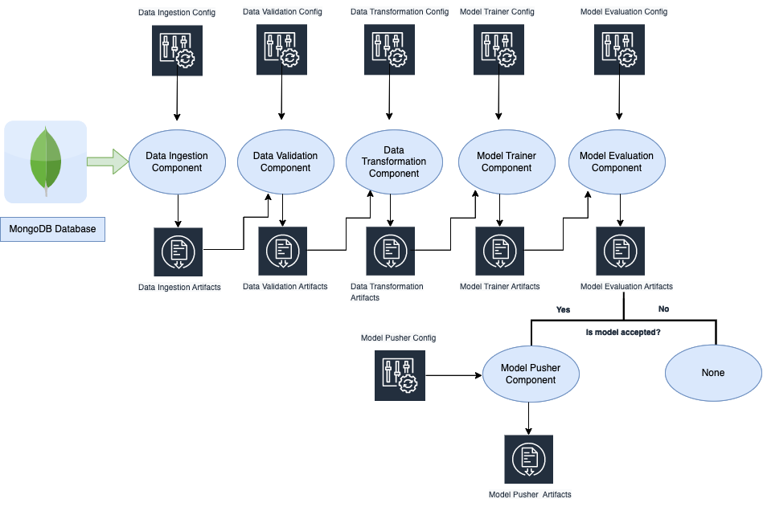
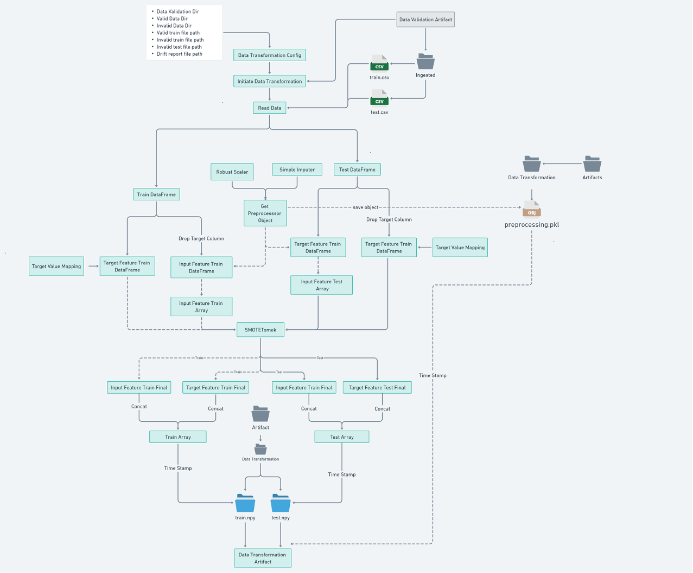

==========================
Machine Learning Pipeline
==========================

The training pipeline consists of the following components(or stages):

* Data Ingestion
* Data Validation
* Data Transformation
* Model Trainer
* Model Evaluation
* Model Pusher

 

High level code flow of the **Training Pipeline** is given below

---------------------------
**Stage 1: Data Ingestion**
---------------------------
High level code flow of the **Data Ingestion Component** is given below:

.. image:: ../project_workflow/ML_PIpeline/1_Data_Ingestion.png
   :width: 1000

------------------------------
**Stage 2: Data Validation**
------------------------------
High level code flow of the **Data Validation Component** is given below:

.. image:: ../project_workflow/ML_PIpeline/2_Data_Validation.png
   :width: 1000

---------------------------------
**Stage 3: Data Transformation**
---------------------------------
High level code flow of the **Data Transformation Component** is given below:

---------------------------
**Stage 4: Model Trainer**
---------------------------
High level code flow of the **Model Trainer Component** is given below:

.. image:: ../project_workflow/ML_PIpeline/4_Model_Trainer.png
   :width: 1000

-----------------------------
**Stage 5: Model Evaluation**
-----------------------------
High level code flow of the **Model Evaluation Component** is given below:

.. image:: ../project_workflow/ML_PIpeline/5_Model_Evaluation.png
   :width: 1000

-----------------------------
**Stage 6: Model Pusher**
-----------------------------
High level code flow of the **Model Pusher Component** is given below:

.. image:: ../project_workflow/ML_PIpeline/6_Model_Pusher.png
   :width: 1000

